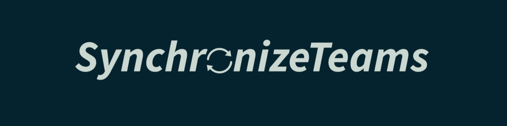

  

<h1 align="center">👋 Welcome to SynchronizeTeams</h1>

  

---

  
  
  

---

### 🌍 About Us

> **SynchronizeTeams** is a creative development organization crafting next-gen web & mobile applications using **Laravel**, **Golang**, **Nuxt**, **Svelte**, **React**, and **Flutter**.  
> We synchronize ideas, data, and people through technology that’s **innovative, fast, and reliable.**  
>  
> 🚀 *Motto:* **Sync With Us**

---

### 🛠️ Languages & Tools

  

---

### 🚀 Team Highlights

- 👨‍💻 **Active Members:** 6+ passionate developers  
- 🧱 **Projects:** 10+ web & mobile apps  
- ⚙️ **Core Stack:** Laravel • Golang • Nuxt • Svelte • React • Flutter  
- 💬 **Approach:** Modern design, performance-driven architecture  
- 💡 **Mission:** Synchronize ideas, data, and people through innovation  

---

### 🌟 Featured Projects

| Project | Description | Stack |
|----------|--------------|--------|
| [SyncHub](https://github.com/SynchronizeTeams/Synchub) | Full-stack digital ecosystem for schools and communities | Laravel • Nuxt • Tailwind |
| [Pesulpeps Portal](https://github.com/SynchronizeTeams/Pesulpeps) | Student-community portal with dynamic content and forum | Nuxt • Laravel API |
| [VoyageHub](https://github.com/SynchronizeTeams/VoyageHub) | Travel planner & budget tracker platform | Golang Fiber • React |
| [Portfolio Web](https://github.com/SynchronizeTeams/Portfolio) | Modern portfolio showcasing our creative works | Svelte • Tailwind CSS |

---

### 📊 Organization Insights

  
  
  

---

### 🌐 Connect With Us

  <a href="https://synchronizeteams.github.io" target="_blank">🌐 Website</a> •
  <a href="https://linkedin.com/in/synchronizeteams" target="_blank">💼 LinkedIn</a> •
  <a href="https://discord.gg/u82hzMXUaZ" target="_blank">💬 Discord</a> •
  <a href="mailto:synchronizeteams@gmail.com" target="_blank">📧 Email</a>

---

  

---

  

  <b>© 2025 SynchronizeTeams — All Rights Reserved</b>

